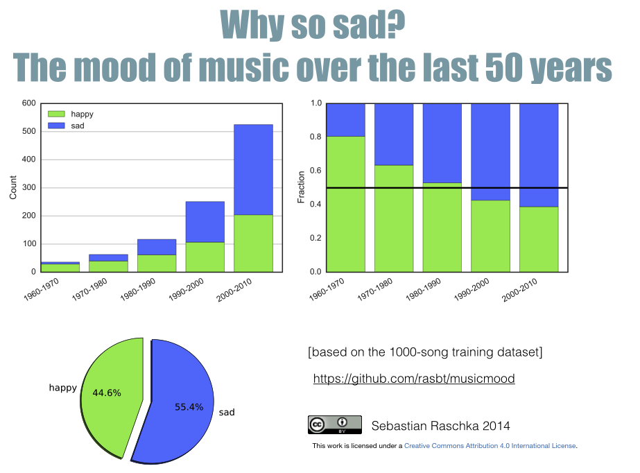
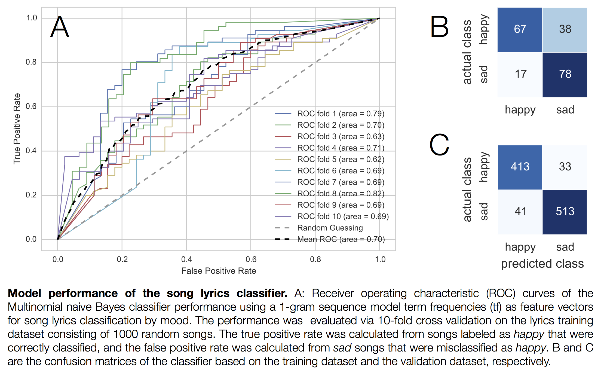
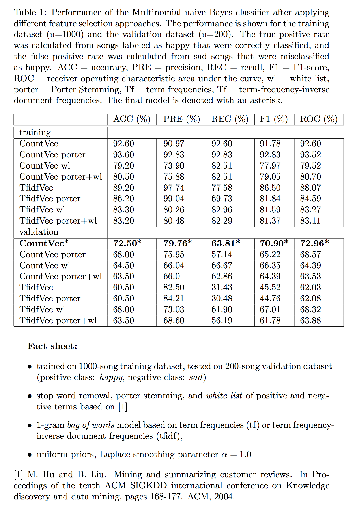

# MusicMood

### A machine learning approach to classify music by mood based on song lyrics.

This project is about building a music recommendation system for users who want to listen to *happy* songs. Such a system can not only be used to brighten up one's mood on a rainy weekend; especially in hospitals, other medical clinics, or public locations such as restaurants, the MusicMood classifier could be used to spread positive mood among people.

 

 
 

### Sections

- [Dataset Summary](#dataset-summary)
- [Exploratory Data Analysis](#exploratory-data-analysis)
- [Results](#results)

 
 

 
 

## Dataset Summary
[back to top](#sections)

- A 10,000-song subset was downloaded from the [Million Song Dataset](http://labrosa.ee.columbia.edu/millionsong/pages/getting-dataset).
 - An English language filter was applied to detect and remove all non-English songs.
 -  The remaining songs were randomly subsampled into a 1000-song training dataset and 200-song validation dataset.

 
 

## Exploratory Data Analysis

[back to top](#sections)

 
 

 
 

## Results
[back to top](#sections)

